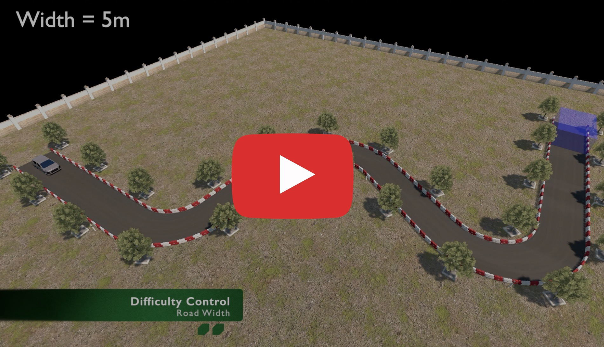

# AutoBench - Autonomous vehicle training and benchmark environment with configurable difficulty


[](https://www.youtube.com/watch?v=Ptg1hnLxy9U)

**AutoBench** is an open-source project base on [Unity ML-Agents Toolkit](https://github.com/Unity-Technologies/ml-agents) featuring high configurability including difficulty, rewards, weather conditions, and visual observation types. Using **REAL** driving license exam in Taiwan as an example to showcase the applicability of autonomous vehicle in reinforcement learning approach with configurable difficulty technique.

Environment supports: 
* General Machine Learning - letting the user implement their own decide algorithm within the out-of-the-box standard training loop. 
* Reinforcement Learning - Containing the entire RL training loop, based on part of ML-Agents trainer with built-in [Proximal Policy Algorithm](https://arxiv.org/abs/1707.06347) algorithm, and recurrent support using [DRQN](https://arxiv.org/abs/1507.06527)

* OpenAI Gym Compatible -  Based on Gym-Unity wrapper, that supports OpenAI Gym interface for further integration meaning users are able to test any Gym-compatible algorithms within AutoBench. [Limitation](docs/Training-Process.md#openai-gym-compitable)

* Benchmark Mode - Complement for above every training mode, ```BenchmarkManager``` is a static class handling benchmark tracking and analysis. Sample code can be found in ```learn_ml.py``` and ```learn_rl.py```


## Features
* Road Geometry based on real license exam.
* Support Reinforcement learning, General machine learning, and OpenAI Gym interface. [(learn more)](docs/Training-Process.md)
* Configurable Difficulty through Road Width, Visual Details and Image types. [(learn more)](docs/Training-and-Environment-Configuration.md)
* Various Visual Observation Types support. [(learn more)](docs/ML-ImageSynthesis.md)
* WASD-control Observation Camera in inference mode
* Configurable Weather Conditions, Time of the Day. [(learn more)](docs/Training-and-Environment-Configuration.md#weather-and-time)
* Configurable Rewards for reward shaping [(learn more)](docs/AgentInfos-Obs-Action-Reward.md#rewards)
* Out-of-the-box Benchmark system [(learn more)](docs/Benchmark.md)
* A Pre-train model [(learn more)](docs/Pretrain-Model-Details.md)

(future work)
* More configurable road spec (curvature, bumpiness)
* More tasks (parallel parking, reverse parking)
* Configurable agent amount

## -> Tutorial and Documentation <-
More info about the [Tutorial and Documentation](docs/)

## References
- [Unity ML-Agents Repository](https://github.com/Unity-Technologies/ml-agents)
- [ML-ImageSynthesis Repository](https://bitbucket.org/Unity-Technologies/ml-imagesynthesis) 
- [Proximal Policy Algorithm](https://arxiv.org/abs/1707.06347)
- [Deep Recurrent Q-Learning for Partially Observable MDPs](https://arxiv.org/abs/1507.06527)

## Citation
Paper Citation (TBA)

## License
[Apache License 2.0](LICENSE)

## Buy me a coffee
Bitcoin: 1ErZXAEoQVzFSkarXKpxfTRzYrp9SALVp2<br>
Ethereum: 0x312ADcc92c3ff549001ea4437A767c512C9546E3

## Feedback
Feel free to give us feedback using the "Issue" section
