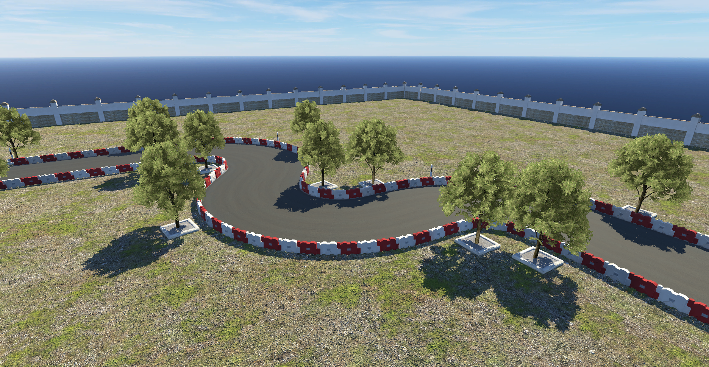

# AutoBench autonomous vehicle training environment


**AutoBench** is an open-source project base on Unity ML-Agents Toolkit
aiming to prodvide all Machine Learning researchers a simple enviornment to learn, train and validate algorithms.

For sufficient validity, the task environments are base on REAL driving license exam in Taiwan.

Including S Curve, Straight, Parallel Parking, Reverse Parking <sup>1</sup>
 
The default training method is using Reinforcement Learning, but I also wrote a sample code for general Machine Learning, which let users to provide the decision method.

## [Task Description](docs/Task-Description.md)

## Features
* Algorithm base on PPO and DRQN 
* Support for multiple environment configurations and training scenarios
* Integrate [Image Synthesis plugin](https://bitbucket.org/Unity-Technologies/ml-imagesynthesis) for pre-segmentation feature
* Add WASD-control Observe Camera in inference mode

(future work)
* Add pre-train model for SCurve Forward
* Configurable weather condition
* Configurable road spec(curvature, bumpiness, width)
* Configurable agent amount
* Configurable reward <sup>2</sup>
* Fully automative benchmark process
* Whole set of other tasks (parallel parking, reverse parking, etc.)
* Integreate all scene into single instance, let users to specify config in python command line.

## How To Run?
Reinforcement Learning
* Clone this repository
* Download built unity instance [link](https://goo.gl/J567Df)
* Modify parameters you desire in trainer_config.yaml->AutoBenchBrain section, or use the default value 
* Run learn.py
* After seeing ```Start training by pressing the Play button in the Unity Editor.```, open (for example) SCurve_Forward_Simple_Segment.exe in SCurve_Forward_Simple_Segment folder

General Machine Learning
* Clone this repository
* Download built unity instance [link](https://goo.gl/J567Df)
* Implement ```def decide(brain_info: BrainInfo):``` in general_ml.py
* Run general_ml.py
* After seeing ```Start training by pressing the Play button in the Unity Editor.```, open (for example) SCurve_Forward_Simple_Segment.exe in SCurve_Forward_Simple_Segment folder

Inference
* Set ```load_model = True``` Load the pre-train model
* Set ```train_model = False``` Don't run any learning algorithm
* Set ```fast_simulation = False``` Enable inference mode, allow you to use WASD-control Observe Camera
* Run learn.py

## References

- [Unity ML-Agent Repository](https://github.com/Unity-Technologies/ml-agents)
- [Proximal Policy Algorithm](https://arxiv.org/abs/1707.06347)
- [Deep Recurrent Q-Learning for Partially Observable MDPs](https://arxiv.org/abs/1507.06527)

## FAQ

### Can you provide the Unity enviroenmt source code?

No, because this project involves lots of asset that came from the Unity Asset Store, according to their EULA, I can only provide the built instance of the environment.

## License
[Apache License 2.0](LICENSE)

## Buy me a coffee
Bitcoin: 1ErZXAEoQVzFSkarXKpxfTRzYrp9SALVp2<br>
Ethereum: 0x312ADcc92c3ff549001ea4437A767c512C9546E3

## Feedback
Any feedback related to this project is recommanded post on Github
Others, you can contact me by (karta1297963.eed02@nctu.edu.com)

<sup>1</sup>Currently only has S Curve task<br> 
<sup>2</sup>Initially I was intend to have user configurable functionallity in first release, but since ML-Agents have some bugs on Curriculum Learning, where's not an easy and elegant solution to implement this, so I decide to move this feature into future works. <br> 
