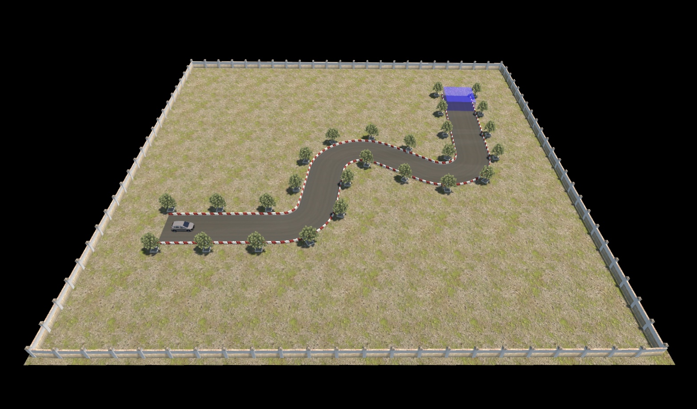
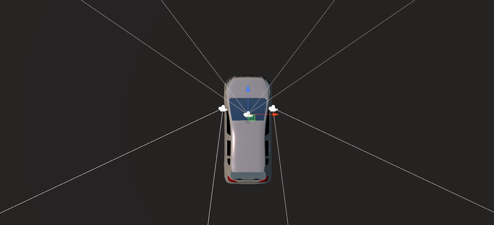

# Environment Details

This environment consists of a 50x50m ground, surrounding by 3m walls, car model dimension is approximately 4.3x1.8x1.4m.

**The goal is to navigate through the S curve path then enter the finish area1 without colliding with barriers.**

Road geometry is based on part of the actual driving license exam in Taiwan which has both forward and backward phase. AutoBench provides a forward / backward option as part of the configuration suite compatible with 3 cameras setup for each agent's visual observations.  

### Vehicle Cameras

One front-facing camera mounted on the top center of the vehicle, two rear-facing cameras simulating each side mirrors of the vehicle. Users can specify each camera with any type of visual observation or simply disable the camera visual output.

To improve training efficiency and speed, AutoBench has 10 agents training in parallel, all agents cannot collide with or see each others.

### Environment Configurations include:
* Road Width
* Forward and Backward
* Level of Details
* Camera Image Types and Resolutions
* Weather Conditions
* Time of Day
* Reward Value(Reward Shaping)

Learn more about [Training and Environment Configuration](Training-and-Environment-Configuration.md)

1 The blue box is just for visualize finish area, agent cannot see it.
