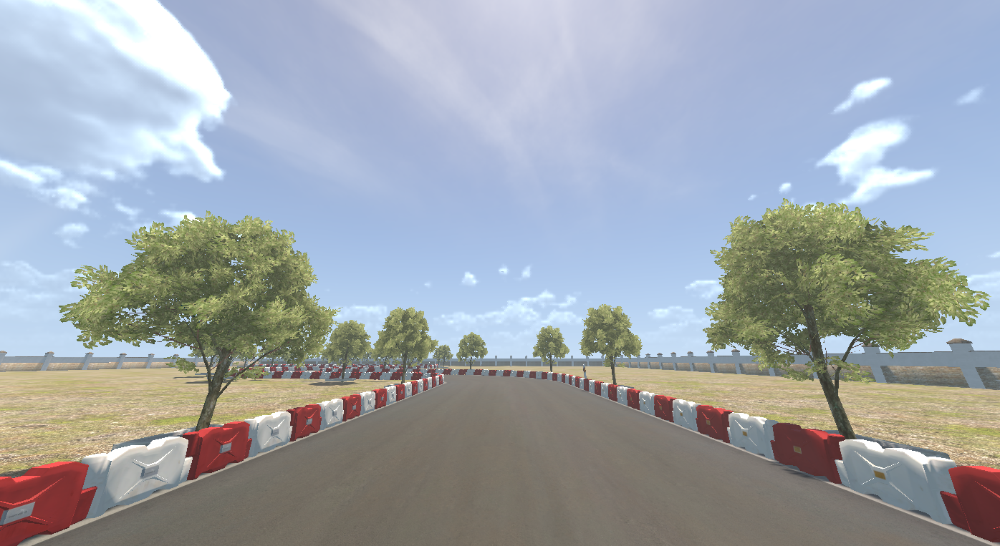
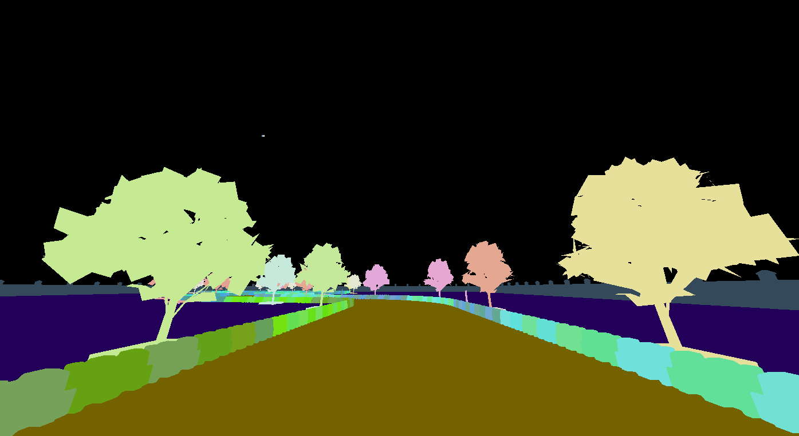
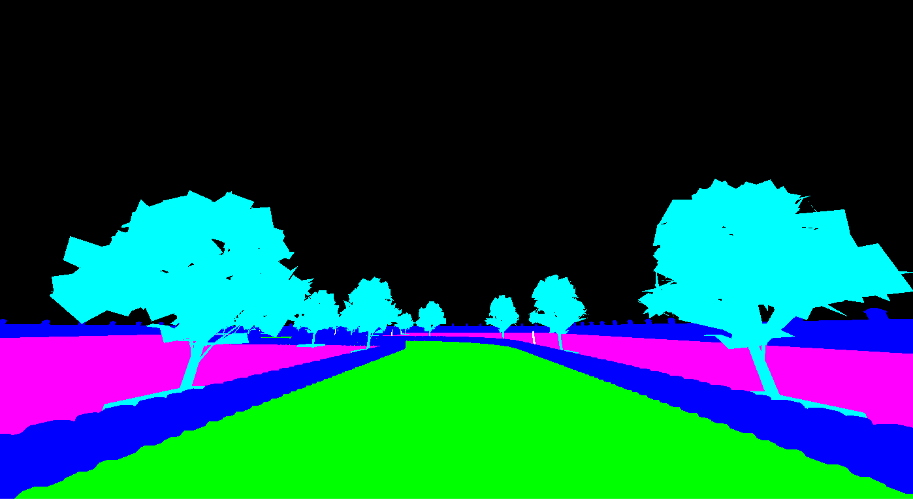
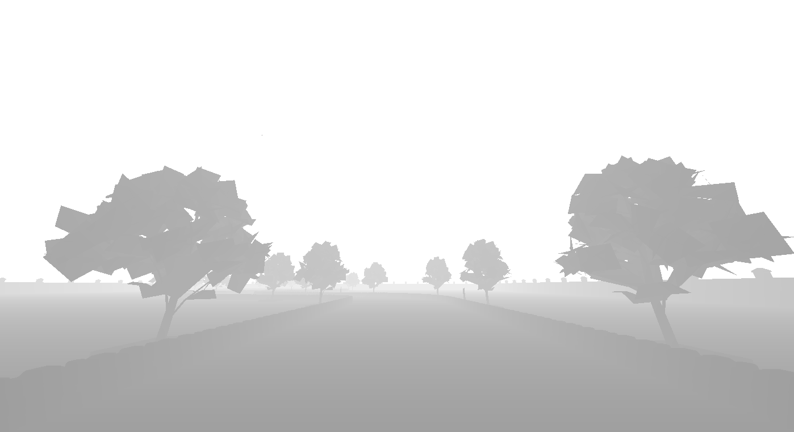
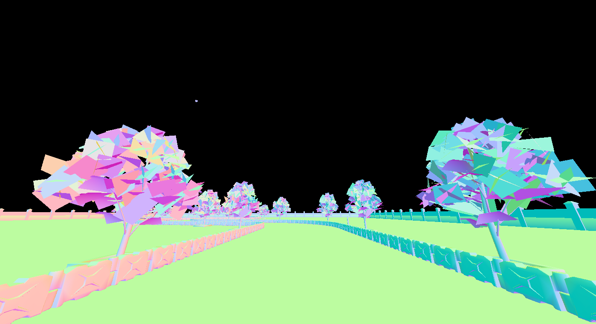
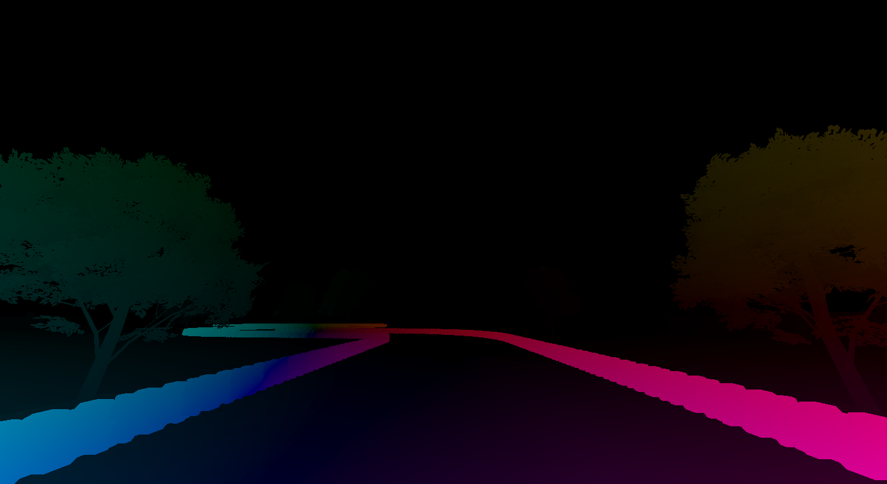

# ML-ImageSynthesis

### Raw Image

### Object ID Segmentation

### Object Type Segmentation

### Depth Map

### Normals

### Optical Flow

Users can choose between raw image or segmentation for different difficulty levels and depth or optical flow for further research.

* Source repo: [ML-ImageSynthesis](https://bitbucket.org/Unity-Technologies/ml-imagesynthesis) 
* Support Image Type : Raw Image, Segmentation, Depth, Opitcal Flow and Normals.
* Type code: 0=Disable, 1=Raw, 2=ObjectID, 3=ObjectType, 4=Depth, 5=Normals, 6=Optical Flow
* More info about the [How to configurable cameras](Setup-Configuration-Files.md#environment-config)

### Limitation
ObjectID Mode doesn't guarantee label consistency, meaning same object may have different labels in different episode, but different objects in the same episode don't have same label, that's because GameObject inside the scene may be destroyed and re-instantiated.
