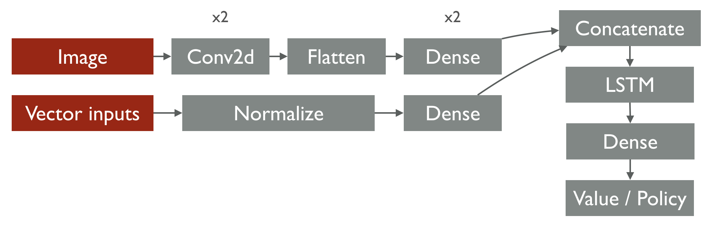
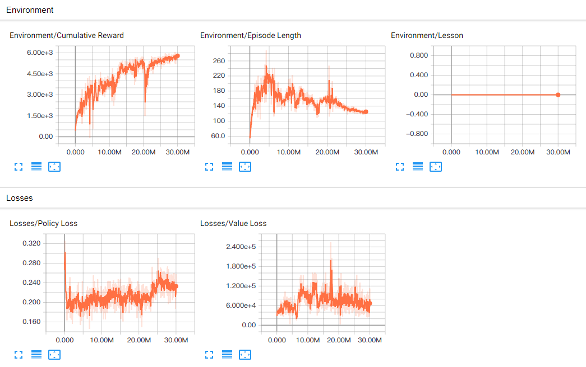
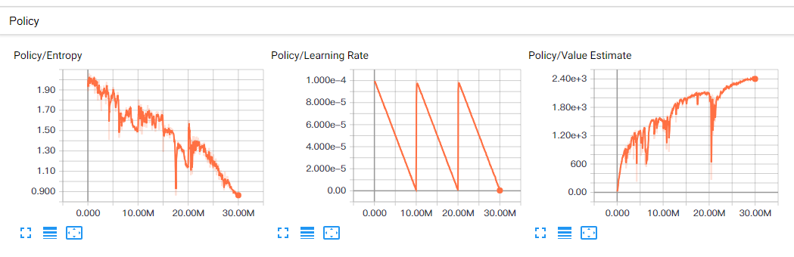

# Pretrain Model Details
### Setup
* Download the [Pretrain Model](https://goo.gl/HunBMB)
* Unzip the file
* Copy and Paste ```Pretrain``` folder under the ```AutoBench/models``` folder (if not exist, create one)
* Set these in ```learn_rl.py```
```
run_id = 'Pretrain'
load_model = True
``` 

### Architecture


The architecture follows the standard [PPO](https://arxiv.org/abs/1707.06347) implementation with the following modification.
* Adding Convolutional Neural Networks (CNN) as a visual encoder
* Adding Long Short Term Memory (LSTM) layer after the concatenation of visual and vector latent features layer to implement recurrent functionality in [Deep Recurrent Q-Network]().

### Tesorboard



### Difficulty and Agents Settings
The following settings are the training configuration of this pre-train baseline 

```
AutoBenchBrain:
    batch_size: 512
    beta: 1.0e-1
    buffer_size: 4096
    epsilon: 0.2
    gamma: 0.99
    hidden_units: 128
    lambd: 0.95
    learning_rate: 1.0e-4
    max_steps: 1.0e7
    memory_size: 256
    normalize: true
    num_epoch: 5
    num_layers: 2
    time_horizon: 512
    sequence_length: 64
    summary_freq: 1000   
    use_recurrent: true

"parameters": {
    "camera1_type": [0],
    "camera2_type": [3],
    "camera3_type": [0],
    "camera1_res_x": [0],
    "camera2_res_x": [50],
    "camera3_res_x": [0],
    "camera1_res_y": [0],
    "camera2_res_y": [50],
    "camera3_res_y": [0],
    "weather_id": [1],
    "time_id": [9],
    "road_width": [8],
    "forward": [true],
    "detail": [false],
    "goal_reward": [500],
    "time_penalty": [-1],
    "collision_penalty": [-300],
    "position_reward": [300],
    "velocity_reward": [1]
  }

```
