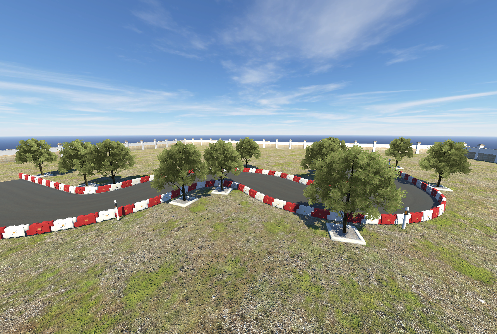
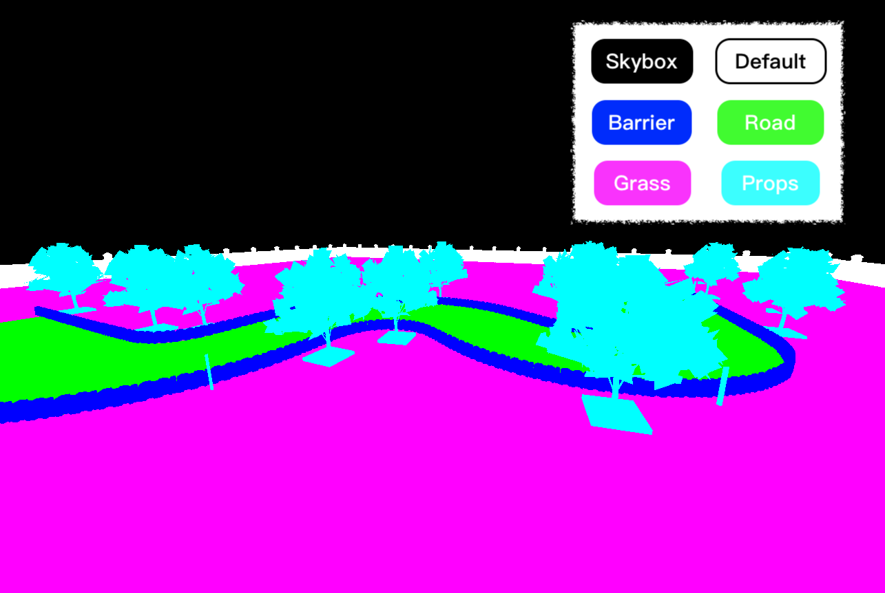

# Task Description

## Task overview

### S Curve 
In this task, agents need to nevigate the the final target and go backward to the starting point.
I set to train on 10 agents for better efficiency

For easy training and testing, I seperate this task into forward and backward task, for different training complexity, the task also have the simple and detail version, details below. 

#### Simple Scene
Aim for easy and fast training. 
The scene will only have road, barrier, wall, all have relative simple geometry and texture.

#### Detail Scene
Aim for realistic training.
The scene will have all props and detail texture for maximum reality.

#### Forward Scene ---------------------------------------------------- Backward Scene
 

#### Real Image ---------------------------------------------------- Segmentation Image
 

## Limitation
* Customization is not available right now.(I'm still working on an alternative) 1 

## RL Spec
State:
* Vehicle velocity (3D)
* Vehicle relative position to target point (3D)
* Vehicle y-axis rotation eular angle (1D)2 
* 1 50x50 gray scale image of front camera for forward task
* 3 50x50 gray scale image of front, rear-right, rear-left camers for backward task 

Reward:
* Time penalty: -1 / timestep
* On the grass: -300
* Hit the barrier: -300 
* Distance between agent and target: closer +300/m (no negative reward if go opposite direction)
* Velocity magnitude: +1 / m/s 
* Success3 : +500

Action:
* +30, 0, -30 degree of streeing angle 
* +1, 0, -0.3 scale of throttle power.
Total combination 9 discrete actions

Done Condiition:
* Step > 1500 (30sec)
* Hit the barrier
* On the grass
* Success3

1You have to start first config exchange to let Unity knows the desire resolution, but at the same time Python side is reciving the default resolution in Unity and constructing the RL model, so in this commiunication sequence it's difficult to config resolution later. 
2In Unity, y-axis is the vertical axis. 
3All 4 wheels in the BoxCollider, vehicle forward vector dot BoxCollider forward vector < 0.5  
