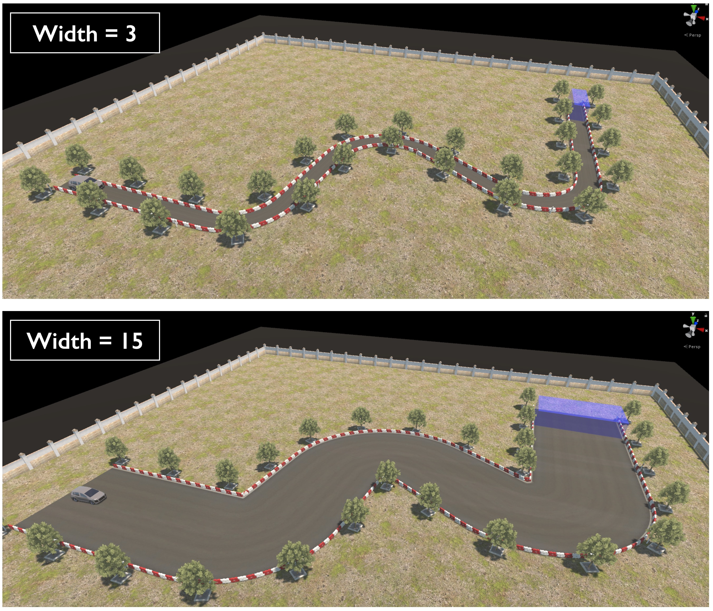
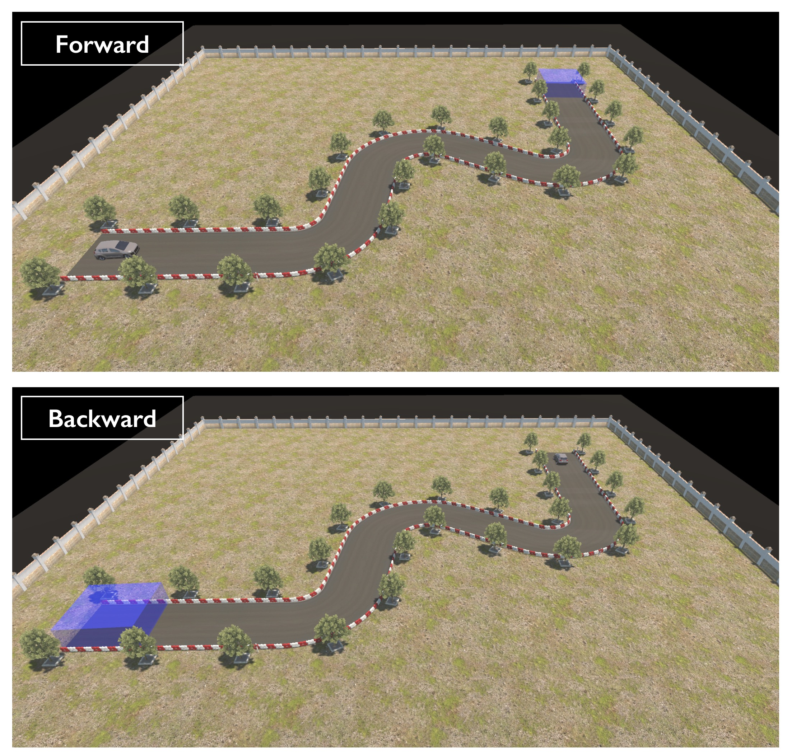
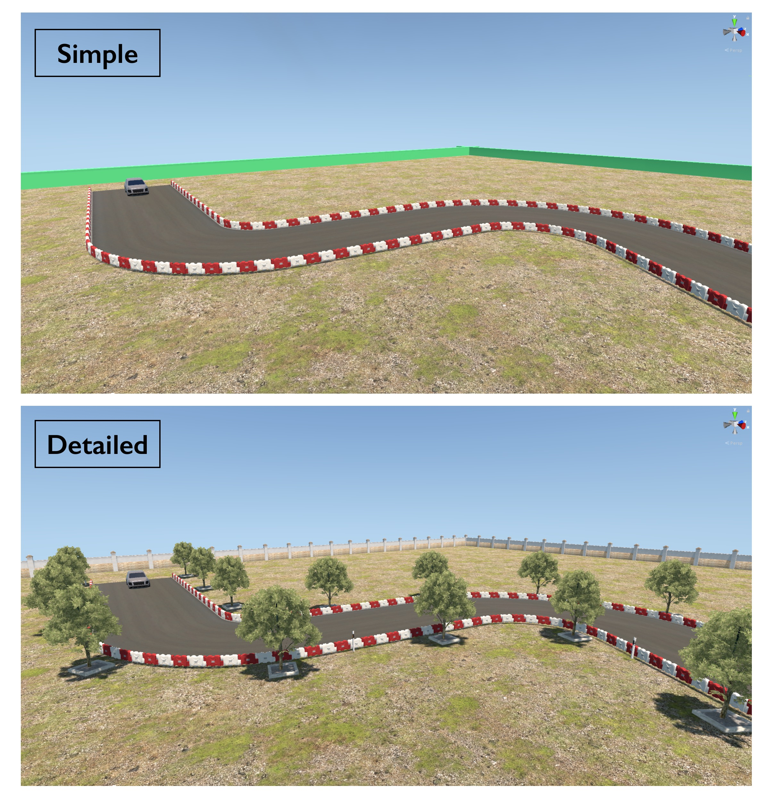
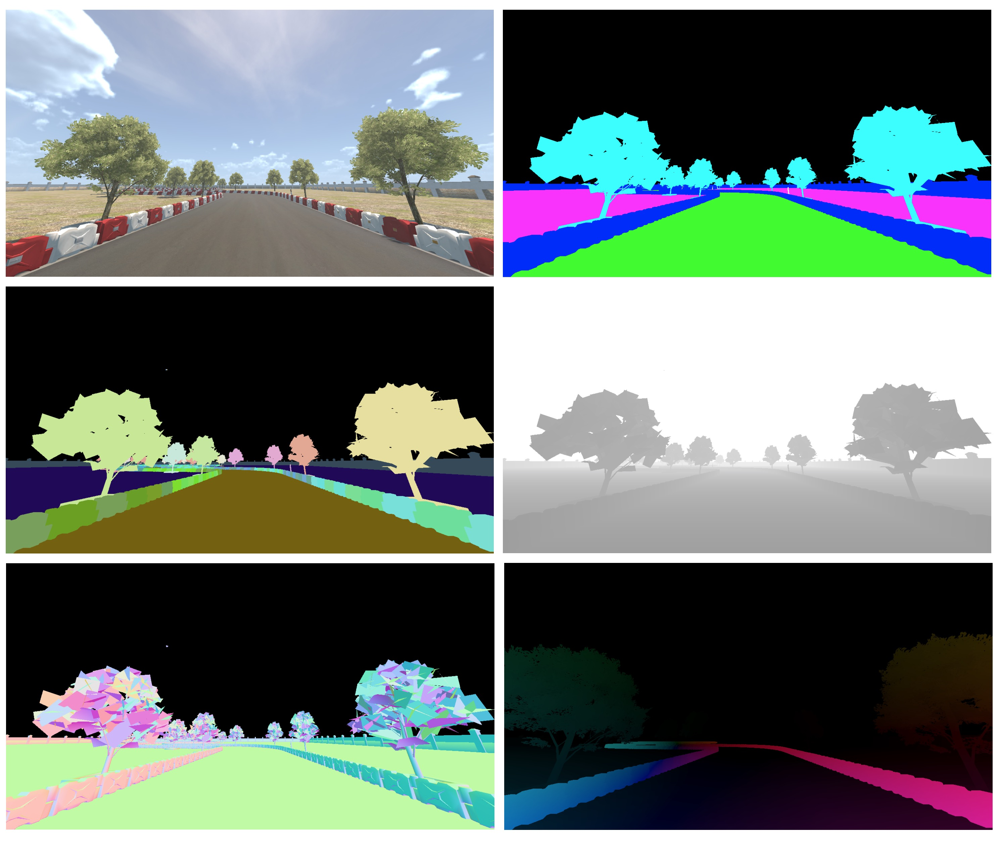
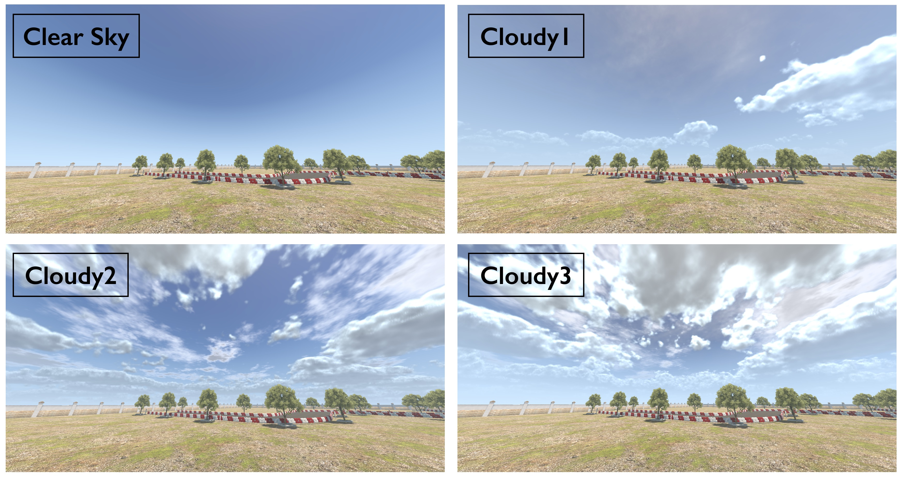
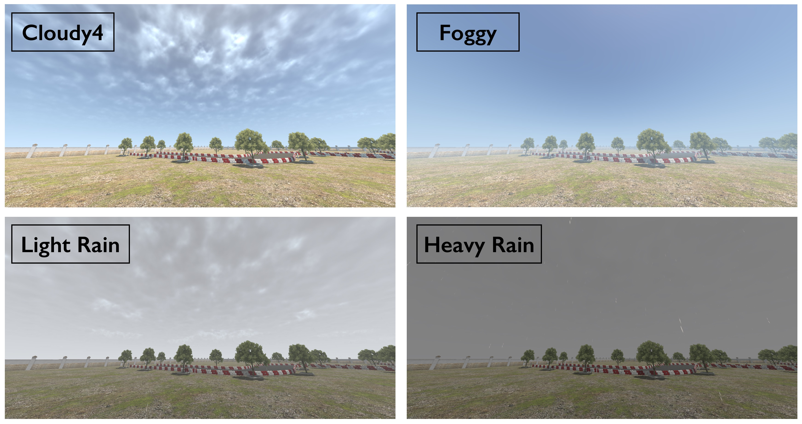
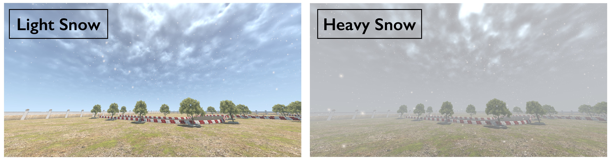
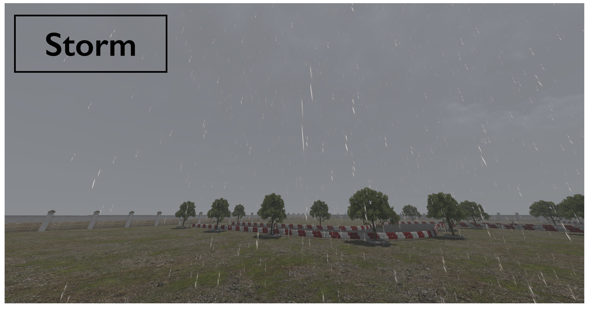
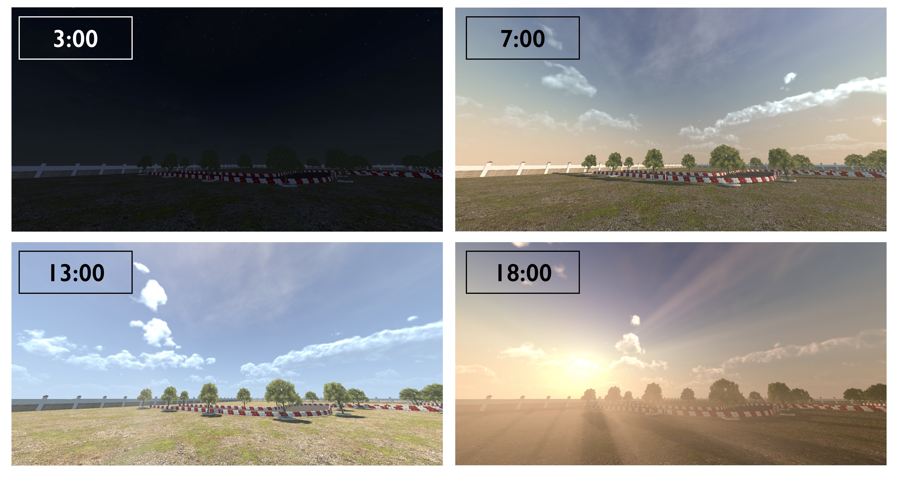

# Training and Environment Configuration

## Road Width
 
 
Road width can be set between 0.1 to 18, controlling the difficulty of environment

## Forward and Backward

Road geometry is based on part of the actual driving license exam in Taiwan which has both forward and backward phase.

## Level of Details
 

## Camera Image Types and Resolutions
 

Cameras can be chosen from various image types, and any perfered resolution.

More info about [Camera Output Type](ML-ImageSynthesis.md)

## Weather and Time
Weather conditions includes:

 
 
 
 

With weather code:
* 0=ClearSky, 1=Cloudy1, 2=Cloudy2, 3=Cloudy3, 4=Cloudy4, 5=Foggy
* 6=LightRain, 7=HeavyRain, 8=LightSnow, 9=HeavySnow, 10=Storm

Time can be set to any float value between 0 and 24 

 

For instance, 9.5 = 9:30am, 18.25 = 6:15pm

### Noice: weather can also effect the environment lighting

## Reward 
AutoBench comes with default reward value trained for pretrain baseline, users can modified the value for further reward shaping.
More info about [Reward Calculation](AgentInfos-Obs-Action-Reward.md#rewards)

## Learn more about [Setup Configuration Files](Setup-Configuration-Files.md)
